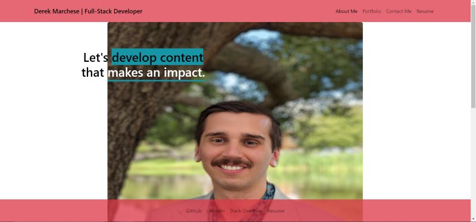

# My React Portfolio

## Description
This is my personal React Full Stack Developer portfolio. It showcases my projects, my background, and resume. I decided to utilize React Bootstrap to style my page because I had never used it before and wanted to challenge myself. I also used emailjs/browser to make my contact me section have real functionality.

## Table of Contents
  * [Installation](#installation)
  * [Usage](#usage)
  * [License](#license)
  * [Contribute](#contributions)
  * [Tests](#tests)
  * [Questions?](#questions)

## Installation
There is no installation needed, check out my portolfio <a href="https://dtm589.github.io/react-portfolio" target="_blank">here</a>!

## Usage

## License

## Contribute
Please feel free to contact me on my email or my github to contribute.

## Tests
No tests available at this time.

## Questions
Please reach out to me at derekmarchese1@gmail.com. 
Or check out my <a href="https://github.com/dtm589">GitHub</a>.